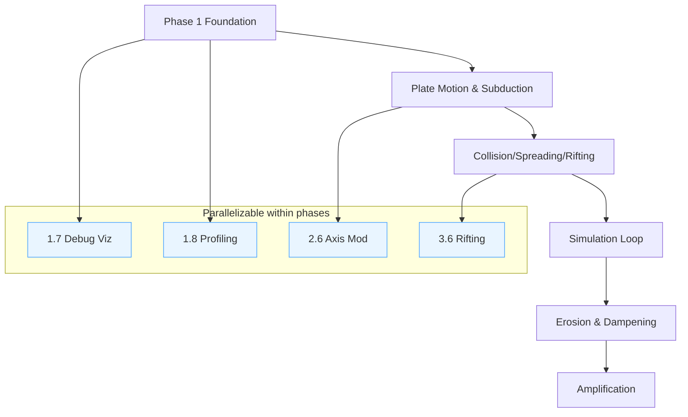

# Procedural Tectonic Planets — Project Plan (UE 5.5)

> Source reference: Documentation/Research/PTP/Implementation_Guide.md
> Note: Per request, this plan excludes timelines/durations.

## 0. Current Status: ✅ PHASE 1 COMPLETE

### Completed Systems (Phase 1 - Foundation)

**Core Foundation:**
- 1.1 Plugin structure: `GaiaPTP` (runtime), `GaiaPTPEditor` (editor), `GaiaPTPCGAL` (CGAL wrapper)
- 1.2 DeveloperSettings: `UGaiaPTPSettings` with Appendix A constants in `Config/DefaultGame.ini`
- 1.3 Fibonacci sphere sampling: `FFibonacciSphere` with uniformity validation
- 1.4 Core data structures: `FCrustData`, `FTerrane`, `FTectonicPlate` with UPROPERTY markup
- 1.5 Plate seeding: Fibonacci-based Voronoi partitioning (deterministic)
- 1.6 CGAL Delaunay triangulation: Spherical adjacency via `Delaunay_triangulation_on_sphere_2`

**Initialization Systems:**
- **Crust initialization**: `FCrustInitialization` class with parallel per-plate setup
  - Continental/oceanic classification (Fisher-Yates shuffle)
  - Elevation, thickness, age initialization
  - Ridge/fold direction setup
- **Plate dynamics**: Random rotation axes and angular velocities
- **Boundary detection**: Parallel neighbor checking (flags plate edges)

**Visualization:**
- **Planet Actor/Component**: `APTPPlanetActor`, `UPTPPlanetComponent` with smart rebuild
- **RealtimeMeshComponent integration**: Points + Surface preview modes
- **Vertex coloring**: Per-plate colors via MurmurHash3
- **Material**: `M_DevPlanet` for vertex color rendering

**Camera System:**
- **Orbit camera**: `APTPOrbitCamera` with Spore-style controls
  - Mouse drag to orbit (infinite rotation)
  - Mouse wheel zoom (proportional)
  - Keyboard WASD/arrows + Q/E
- **Game mode**: `APTPGameMode` sets camera as default pawn

**Workflow Enhancements:**
- **Smart rebuild**: Staleness detection eliminates redundant adjacency builds
- **PIE data persistence**: Cached triangulation duplicates to PIE (instant startup)
- **Performance logging**: Parallel operation timing output
- **Console commands**: Profiling, benchmarking, CVars

**Testing & Automation:**
- 15 automation tests passing (Settings, Fibonacci, Data, Seeding, Adjacency, CrustInit, Determinism)
- 3 build scripts: `Build-PTP.ps1`, `BuildAndTest-PTP.ps1`, `Bench-PTP.ps1`
- CGAL setup script: `Setup-CGAL.ps1`

### Quick Verification
```powershell
# Build and run all 15 tests
PowerShell ./Scripts/BuildAndTest-PTP.ps1

# Quick build without tests
PowerShell ./Scripts/Build-PTP.ps1

# Benchmark rebuild performance
PowerShell ./Scripts/Bench-PTP.ps1
```

**In Editor:**
1. Place `APTPPlanetActor` in persistent level → mesh appears automatically (~4s adjacency build)
2. PIE sessions use cached data (instant startup)
3. Orbit camera auto-spawns with mouse/keyboard controls
4. Configure via Project Settings → Gaia → PTP

**Ready for Phase 2:** Plate movement kernel and tectonic interactions

## 1. Executive Summary
- Goal: Implement a controllable, geologically‑plausible tectonic planet system in Unreal 5.5 that simulates plate motion and interactions to produce a coarse crust model, then amplifies it into high‑resolution terrains usable as Landscapes/meshes.
- Scope: Runtime simulation (CPU first), editor tooling, debug visualization, persistence, oceanic/continental amplification, and export to Landscape/heightfields. Out of scope: photoreal oceans/atmosphere, full climate/hydrology.
- Key Deliverables:
  - Core modules: sampling, plates, interaction kernels (subduction, collision, oceanic crust generation, rifting), erosion/dampening, amplification.
  - Editor utilities: start/pause/step controls, event triggers, visual overlays.
  - Data outputs: coarse crust datasets and high‑res heightfields/meshes.
  - Tests and benchmarks; constants configurable via DeveloperSettings.
- Success Criteria:
  - Reproduces phenomena and controls described in the paper and guide.
  - Stable stepping at configured resolutions; deterministic seeds; validated outputs with automation tests; exportable terrains integrated in an example map.

## 2. Phases & Milestones
(Referenced headings from the guide shown as file:line.)

1) Phase: Foundation — Sphere, Data, Constants (Guide: Documentation/Research/PTP/Implementation_Guide.md:63)
- Goal: Establish sampling, core data structures, constants, initial plate seeding, visualization and tests.
- Prerequisites: UE 5.5 project compiles; modules scaffolded.
- Deliverables: Fibonacci sampler, plate/crust structures, initial Voronoi partition, debug views, unit tests, constants config, profiling harness.
- Success Criteria: Checkpoint 1 met (Documentation/Research/PTP/Implementation_Guide.md:530).

2) Phase: Plate Movement & Subduction (Guide: ...:609)
- Goal: Implement geodetic motion and subduction kernel with uplift curves and trench formation.
- Prerequisites: Phase 1 complete.
- Deliverables: Motion step, boundary detection, subduction wedge model, uplift curves f/g/h, debug overlays, tests.
- Success Criteria: Checkpoint 2 met (...:885).

3) Phase: Collision, Seafloor Spreading, Rifting (Guide: ...:959)
- Goal: Implement continental collision (slab break + fold/orogeny), oceanic crust generation along ridges, plate rifting events.
- Prerequisites: Phases 1–2 complete.
- Deliverables: Collision kernel, ridge generation and aging, rifting/fragmentation with Voronoi split, tests.
- Success Criteria: Checkpoint 3 met (...:1430).

4) Phase: Simulation Loop Integration (Guide: Complete Tectonic Simulation Loop — ...:1395)
- Goal: Orchestrate per‑step processing, state persistence, editor controls, and performance instrumentation.
- Prerequisites: Phases 1–3 complete.
- Deliverables: Loop controller, pause/step UI, save/load, determinism tests, perf stats.
- Success Criteria: Stable loop with all kernels togglable.

5) Phase: Erosion & Dampening (Guide: ...:1523)
- Goal: Add continental erosion and oceanic dampening + trench sediment approximation per guide.
- Prerequisites: Phase 4 complete.
- Deliverables: Erosion/dampening passes, parameters in settings, tests/visual validation.
- Success Criteria: Checkpoint 4 met (...:1799).

6) Phase: Amplification (Guide: ...:1900)
- Goal: Oceanic procedural relief (Gabor‑like) and exemplar‑based continental relief; produce high‑res outputs.
- Prerequisites: Phases 1–5 complete.
- Deliverables: Oceanic/continental amplifiers, exemplar dataset integration, export to Landscape/meshes.
- Success Criteria: Checkpoint 5 met (...:2307) and “Complete System Implemented” (...:2358).

## 3. Task Breakdown (Detailed)
Format: atomic tasks (1–4h), each with acceptance and validation.

### Phase 1 — Foundation

#### Task ID: 1.1 - Create plugin and modules
- Description: Create `GaiaPTP` plugin with `GaiaPTP` (runtime) and `GaiaPTPEditor` (editor) modules; add to `.uplugin` and `*.Build.cs`.
- Acceptance Criteria: Project compiles; modules load; logging category present.
- Dependencies: —
- Estimated Effort: 2h
- Technical Considerations: Use `DeveloperSettings`, `RealtimeMeshComponent` (for rendering), `GeometryScripting/GeometryFramework` (for mesh adjacency).
- Implementation Reference: Documentation/Research/PTP/Implementation_Guide.md:29
- Validation: Launch Editor; verify modules in Output Log.

#### Task ID: 1.2 - Developer settings for constants
- Description: Add `UGaiaPTPSettings` with Appendix A constants (time step, elevations, collision distances, radii) and tunables.
- Acceptance Criteria: Editable in Project Settings; defaults match Appendix A table.
- Dependencies: 1.1
- Estimated Effort: 2h
- Technical Considerations: Config export via `DefaultGame.ini`.
- Implementation Reference: ...:2452
- Validation: Automation test reads settings; asserts values.

#### Task ID: 1.3 - Fibonacci sphere sampler
- Description: Implement `FFibonacciSphere::GeneratePoints(int32 N, float Radius)`.
- Acceptance Criteria: Exactly N points; distance≈Radius; uniformity variance ≤5%; 500k alloc OK.
- Dependencies: 1.1
- Estimated Effort: 3h
- Technical Considerations: Golden angle π(3−√5); SIMD optional.
- Implementation Reference: ...:63
- Validation: Unit tests for N={1k,10k,500k}; visualize point cloud.

#### Task ID: 1.4 - Core data structures
- Description: Add `FCrustData`, `FTerrane`, `FTectonicPlate` as in guide with getters/setters.
- Acceptance Criteria: Compiles; default init per guide; getters tested.
- Dependencies: 1.1
- Estimated Effort: 2h
- Technical Considerations: Use km units consistently.
- Implementation Reference: around ...:200–320 excerpt
- Validation: Unit tests for defaults and simple methods.

#### Task ID: 1.5 - Initial plate seeding and Voronoi partition
- Description: Seed plate centroids (Fibonacci over sphere); assign points by nearest centroid (spherical distance); build plate membership arrays.
- Acceptance Criteria: All points assigned; target plate count met; continental ratio applied.
- Dependencies: 1.3, 1.4
- Estimated Effort: 3h
- Technical Considerations: KD‑tree or uniform hash for neighbor queries.
- Implementation Reference: ...:"Initial Plate Generation" section
- Validation: Colorized plate overlay; histogram of point counts.

#### Task ID: 1.6 - Spherical triangulation and adjacency
- Description: Implement CGAL-backed spherical triangulation and adjacency provider module; expose interface and smoke tests.
- Acceptance Criteria: Provider builds; returns triangle list + per-point neighbor list; smoke test passes (or skips with clear message if CGAL not installed).
- Dependencies: 1.3, 1.5
- Estimated Effort: 6h (scaffold + adapter + tests)
- Technical Considerations: CGAL via vcpkg (Boost/GMP/MPFR); use convex hull of unit-sphere points; map vertices back to original indices.
- Implementation Reference: CGAL module files in `Plugins/GaiaPTP/Source/GaiaPTPCGAL/` and `Scripts/Setup-CGAL.ps1`.
- Validation: `GaiaPTP.Adjacency.Smoke` automation test; later boundary continuity checks (Phase 2).

#### Task ID: 1.7 - Debug visualization utilities
- Description: Draw points, plate colors, vectors (fold/ridge), and boundaries.
- Acceptance Criteria: Toggleable overlays; perf acceptable on 500k points with point‑cloud thinning.
- Dependencies: 1.5, 1.6
- Estimated Effort: 3h
- Technical Considerations: Instanced mesh or Niagara sprites.
- Implementation Reference: ...:29
- Validation: In‑editor visual inspection.

#### Task ID: 1.8 - Profiling + determinism harness
- Description: Add scoped stats, CSV profiler hooks; seedable RNG wrapper.
- Acceptance Criteria: Deterministic for same seed/settings; stats visible.
- Dependencies: 1.1
- Estimated Effort: 2h
- Technical Considerations: `FRandomStream` with explicit seeds.
- Implementation Reference: ...:“Implementation Details”
- Validation: Two runs match hashes of crust arrays.

### Phase 2 — Plate Movement & Subduction

#### Task ID: 2.1 - Geodetic motion computation
- Description: Implement plate angular motion v = ω × p; update positions (or store velocities) per step.
- Acceptance Criteria: Numeric tests of cross product; speed scales with distance from axis.
- Dependencies: 1.4, 1.5
- Estimated Effort: 2h
- Technical Considerations: Keep points on sphere via renormalization.
- Implementation Reference: ...:"Plate movement" near ...:200–280
- Validation: Unit test compares analytic speeds on great circle.

#### Task ID: 2.2 - Boundary detection
- Description: Mark edges where adjacent points have different `PlateId`; produce boundary polylines.
- Acceptance Criteria: Continuous boundaries; <1% orphan edges.
- Dependencies: 1.6
- Estimated Effort: 3h
- Technical Considerations: Edge hash map; dedupe via epsilon on geodesic distance.
- Implementation Reference: ...:609
- Validation: Visual overlay lines.

#### Task ID: 2.3 - Subduction trigger logic
- Description: Detect oceanic–continental or oceanic–oceanic convergence; compute plunge front and relative speed.
- Acceptance Criteria: Front segments flagged with metadata; stable across steps.
- Dependencies: 2.1, 2.2
- Estimated Effort: 3h
- Technical Considerations: Relative velocity along boundary tangents.
- Implementation Reference: ...:"Subduction" ...:609–885
- Validation: Unit tests on synthetic two‑plate setup.

#### Task ID: 2.4 - Uplift profiles f(d), g(v), h(z)
- Description: Implement piecewise curves from guide for distance, speed, and height transfer; expose in settings.
- Acceptance Criteria: Curve functions unit‑tested; monotonic properties hold; clamps respected.
- Dependencies: 2.3
- Estimated Effort: 3h
- Technical Considerations: Use `FRichCurve` for authoring; cache LUTs for perf.
- Implementation Reference: ...:Figures/eqs in subduction section
- Validation: Golden tests comparing values at sample points.

#### Task ID: 2.5 - Subduction wedge deformation
- Description: Apply uplift and trench deepening to crust samples near front; update `OceanicAge`, `Elevation`, `OrogenyType=Andean`.
- Acceptance Criteria: Terrain cross‑sections match expected profiles; wedge width configurable.
- Dependencies: 2.4
- Estimated Effort: 3h
- Technical Considerations: Kernel over boundary band with falloff.
- Implementation Reference: ...:Figure 5–7 area
- Validation: Visual cross‑section plots; unit test on 1D profile.

#### Task ID: 2.6 - Local rotation axis modification near subduction
- Description: Adjust plate rotation axis near long subduction fronts per guide.
- Acceptance Criteria: Axis modulation bounded; no instability.
- Dependencies: 2.3
- Estimated Effort: 2h
- Technical Considerations: Small ε scaling; blend back to base axis.
- Implementation Reference: ...:left column with axis tweak
- Validation: Assert angular changes < threshold; visual arrows.

### Phase 3 — Collision, Seafloor Spreading, Rifting

#### Task ID: 3.1 - Continental collision kernel
- Description: Implement collision influence radius r, uplift, fold direction update, and set `OrogenyType=Himalayan`.
- Acceptance Criteria: Influenced zone radius matches formula; uplift applied only on continental side.
- Dependencies: 2.1, 2.2
- Estimated Effort: 3h
- Technical Considerations: Use compactly supported falloff f(·).
- Implementation Reference: ...:959–1395
- Validation: Synthetic two‑continent collision test.

#### Task ID: 3.2 - Terrane detach/attach
- Description: Detach small terranes near collision; reattach to collided plate.
- Acceptance Criteria: Terrane IDs updated; area conservation within tolerance.
- Dependencies: 3.1
- Estimated Effort: 3h
- Technical Considerations: Threshold by area and distance to front.
- Implementation Reference: ...:Figure 7 and text
- Validation: Unit test on tagged terrane region.

#### Task ID: 3.3 - Ridge identification
- Description: Identify divergent boundaries; compute ridge direction field r(p).
- Acceptance Criteria: Ridge polylines continuous; direction vectors normalized.
- Dependencies: 2.2
- Estimated Effort: 2h
- Technical Considerations: Boundary normal from plate velocities.
- Implementation Reference: ...:"Oceanic crust generation" start
- Validation: Visual ridge overlay.

#### Task ID: 3.4 - Oceanic crust generation along ridges
- Description: Blend interpolated elevation z_ℓ with template ridge profile z_r; set `OceanicAge=0`, `Thickness`, and `RidgeDirection`.
- Acceptance Criteria: Cross‑sections match guide; abyssal plains form with age.
- Dependencies: 3.3
- Estimated Effort: 4h
- Technical Considerations: Sampling band width; iterative steps between plates.
- Implementation Reference: ...:Figure 8–9, formulas
- Validation: Profile tests at varying distances; visual time‑lapse.

#### Task ID: 3.5 - Oceanic aging and dampening params (data only)
- Description: Add age increment and density changes to oceanic crust data each step (no erosion yet).
- Acceptance Criteria: Age increases deterministically; elevation trend stored.
- Dependencies: 3.4
- Estimated Effort: 1h
- Technical Considerations: Clamp to max age.
- Implementation Reference: ...:text near dampening
- Validation: Unit test increments.

#### Task ID: 3.6 - Plate rifting event system
- Description: Implement discrete rifting event: split plate into N sub‑plates via Voronoi; move seeds by fracture curve.
- Acceptance Criteria: New plates created; boundaries valid; history logged.
- Dependencies: 1.5, 2.2
- Estimated Effort: 4h
- Technical Considerations: Poisson‑like trigger; also allow manual trigger.
- Implementation Reference: ...:Plate Rifting section
- Validation: Visual before/after; integrity checks.

#### Task ID: 3.7 - Kernel toggles and ordering
- Description: Allow enabling/disabling kernels and define execution order for step.
- Acceptance Criteria: Configurable order persists; tests run with subsets.
- Dependencies: 3.1–3.6
- Estimated Effort: 1h
- Technical Considerations: Strategy list pattern.
- Implementation Reference: ...:1395
- Validation: Automation tests run matrix of toggles.

### Phase 4 — Simulation Loop Integration

#### Task ID: 4.1 - Loop controller and stepping
- Description: Implement `UTectonicPlanet::Step()` applying motion and kernels; maintain `StepCount` and time accumulator.
- Acceptance Criteria: Step runs without memory growth; deterministic.
- Dependencies: 2.x, 3.x
- Estimated Effort: 3h
- Technical Considerations: Separate read/write buffers for crust arrays.
- Implementation Reference: ...:1395
- Validation: 1k‑step soak test.

#### Task ID: 4.2 - Editor UI (start/pause/step/trigger)
- Description: Editor Utility Widget to control simulation and fire rifts.
- Acceptance Criteria: Buttons work; hotkeys; state reflected in viewport.
- Dependencies: 4.1
- Estimated Effort: 3h
- Technical Considerations: `Blutility`, or Editor Subsystem.
- Implementation Reference: ...:“Control” discussion
- Validation: Manual and automation UI test.

#### Task ID: 4.3 - Save/Load planet state
- Description: Serialize points, crust arrays, plates, terranes, seeds.
- Acceptance Criteria: Reload reproduces state hash.
- Dependencies: 4.1
- Estimated Effort: 3h
- Technical Considerations: Compressed binary; versioning.
- Implementation Reference: ...:“Implementation Details”
- Validation: Round‑trip tests.

#### Task ID: 4.4 - Performance instrumentation
- Description: Add CSV profiling and draw stats per kernel.
- Acceptance Criteria: CSV generated; kernel timings reported.
- Dependencies: 4.1
- Estimated Effort: 2h
- Technical Considerations: `FScopedDurationTimer`.
- Implementation Reference: ...:“Performance” text
- Validation: Inspect CSV; thresholds in tests.

### Phase 5 — Erosion & Dampening

#### Task ID: 5.1 - Continental erosion pass
- Description: Apply erosion model E with configurable strength each step to continental crust.
- Acceptance Criteria: Elevation decreases toward expected mean; monotone where no uplift.
- Dependencies: 4.1
- Estimated Effort: 3h
- Technical Considerations: Simple exponential or convolution kernel per guide.
- Implementation Reference: ...:1523
- Validation: Numeric regression vs baseline.

#### Task ID: 5.2 - Oceanic dampening pass
- Description: Increase density/abyssal deepening with age; apply sediment accretion at trenches (approx).
- Acceptance Criteria: Trench floors fill slightly; abyssal plains deepen with age.
- Dependencies: 3.5, 4.1
- Estimated Effort: 3h
- Technical Considerations: Use constants from Appendix A for rates.
- Implementation Reference: ...:4.5 in guide
- Validation: Trend tests with synthetic ages.

#### Task ID: 5.3 - Parameter exposure and presets
- Description: Expose per‑kernel parameters and author presets (oceanic/continental worlds).
- Acceptance Criteria: Presets round‑trip; parameters editable.
- Dependencies: 5.1, 5.2
- Estimated Effort: 2h
- Technical Considerations: Data assets.
- Implementation Reference: ...:1523–1799
- Validation: Preset load test.

### Phase 6 — Amplification

#### Task ID: 6.1 - Oceanic procedural relief (noise)
- Description: Implement oriented 3D Gabor‑like noise using ridge direction and age; output high‑res displacement.
- Acceptance Criteria: Visual resemblance to ocean floor lineations; controllable frequency bands.
- Dependencies: 3.3, 3.4, 4.1
- Estimated Effort: 4h
- Technical Considerations: GPU compute optional; CPU baseline first.
- Implementation Reference: ...:1900–2307
- Validation: Frequency analysis; visual gallery.

#### Task ID: 6.2 - Continental exemplar‑based synthesis
- Description: Blend DEM exemplars (e.g., SRTM/ETOPO) by local attributes (fold dir, elevation range, orogeny type).
- Acceptance Criteria: Seamless blend; attributes drive selection; no obvious tiling.
- Dependencies: 4.1
- Estimated Effort: 4h
- Technical Considerations: Precompute exemplar pyramids; license compliance.
- Implementation Reference: ...:“Exemplar‑based generator” section
- Validation: Patch‑based similarity metrics; visual inspection.

#### Task ID: 6.3 - Heightfield/mesh export
- Description: Bake amplified terrain to UE Landscape or meshes; support tiled export.
- Acceptance Criteria: Landscape created with correct scale; normals computed; streaming works.
- Dependencies: 6.1, 6.2
- Estimated Effort: 3h
- Technical Considerations: World Partition friendly tile sizes.
- Implementation Reference: ...:“Amplification Complete”
- Validation: Load in test map; walkable; memory profile.

#### Task ID: 6.4 - Example map and documentation
- Description: Provide example level with UI, sample planet, and instructions.
- Acceptance Criteria: QA script runs; README/How‑To present.
- Dependencies: 6.3
- Estimated Effort: 2h
- Technical Considerations: Keep assets small; Git LFS for large.
- Implementation Reference: ...:2358–2409
- Validation: Fresh clone smoke test.

## 4. Dependency Graph



- Critical Path: 1.1→1.2→1.3→1.5→1.6→2.1→2.2→2.3→2.4→2.5→3.1→3.4→4.1→5.1→6.1→6.3.
- Parallelizable: Visualization (1.7), profiling (1.8), axis tweak (2.6), rifting (3.6), UI (4.2), presets (5.3).
- Bottlenecks: Triangulation (1.6), ridge generation (3.4), exemplar data prep (6.2).

## 5. Risk Register
- Risk: Numerical instability on sphere (drift off radius). Impact: Medium; Likelihood: Medium; Mitigation: Renormalize positions, use double where needed. Related: 2.1, 4.1.
- Risk: Triangulation robustness at high N. Impact: High; Likelihood: Medium; Mitigation: Use UE Geometry libs or CGAL; add integrity checks. Related: 1.6.
- Risk: Performance at 500k points. Impact: High; Likelihood: Medium; Mitigation: Throttled viz, SoA data layout, kernel tiling; optional GPU. Related: 1.7, 4.4.
- Risk: DEM licensing/size for exemplars. Impact: Medium; Likelihood: Medium; Mitigation: Use freely licensed subsets; store with Git LFS; document sources. Related: 6.2.
- Risk: Non‑determinism across threads. Impact: Medium; Likelihood: Medium; Mitigation: Deterministic RNG wrapper; controlled threading. Related: 4.1.
- Risk: Edge cases in rifting creating sliver plates. Impact: Medium; Likelihood: Medium; Mitigation: Area thresholds; merge tiny plates. Related: 3.6.
- Risk: Boundary detection aliasing. Impact: Medium; Likelihood: Medium; Mitigation: Mesh adjacency vs grid; smoothing. Related: 2.2.
- Risk: Visual artifacts in amplification seams. Impact: Medium; Likelihood: Medium; Mitigation: Multi‑band blending; overlap and feathering. Related: 6.1, 6.2.
- Risk: Memory pressure during amplification. Impact: High; Likelihood: Medium; Mitigation: Tile processing; streaming; downsample caches. Related: 6.1–6.3.
- Risk: Export mismatch scales/units. Impact: Low; Likelihood: Medium; Mitigation: Single source of truth for units; tests. Related: 6.3.

## 6. Technical Debt & Decision Log
- Decision: CPU‑first kernels with optional GPU later. Rationale: Complexity control. Alternatives: Compute shaders. Trade‑offs: Lower peak perf vs faster iteration. Review: after Phase 4.
- Decision: Use UE Geometry tools for adjacency. Rationale: Reduce external deps. Alternatives: CGAL. Trade‑offs: Robustness; CGAL license/size. Review: after 1.6.
- Decision: km units across simulation. Rationale: Matches paper. Alternatives: meters. Trade‑offs: Avoid float range issues. Review: stable after Phase 2.
- Decision: Deterministic RNG per system. Rationale: Reproducibility. Alternatives: std::random. Trade‑offs: Slight overhead. Review: after Phase 4.
- Decision: Exemplar data minimal set. Rationale: Repo size. Alternatives: Full DEMs. Trade‑offs: Variety vs size. Review: after 6.2.

## 7. Integration Points & Checkpoints
- Checkpoint 1 — Foundation Complete (Guide: ...:530)
  - Entry: Tasks 1.1–1.6 done; viz available.
  - Validation: Unit tests pass; plate partitions visualized.
  - Exit: Proceed to motion/subduction.
  - Rollback: Reduce N points; verify adjacency.
- Checkpoint 2 — Plate Movement & Subduction Complete (Guide: ...:885)
  - Entry: 2.1–2.6 implemented.
  - Validation: Two‑plate demo shows trenches/uplift as expected.
  - Exit: Add remaining interactions.
  - Rollback: Disable axis mod; tune curves.
- Checkpoint 3 — All Tectonic Interactions Complete (Guide: ...:1430)
  - Entry: Collision, spreading, rifting in place.
  - Validation: Loop with toggles simulates scenarios in guide.
  - Exit: Integrate loop fully and polish.
  - Rollback: Turn off problematic kernel; isolate with tests.
- Checkpoint 4 — Erosion & Dampening Complete (Guide: ...:1799)
  - Entry: Erosion and oceanic dampening passes.
  - Validation: Trends match expected; no oscillations.
  - Exit: Amplification work.
  - Rollback: Lower strengths; reduce step size.
- Checkpoint 5 — Amplification Complete (Guide: ...:2307)
  - Entry: Amplifiers implemented and parameterized.
  - Validation: Visual comparison vs paper figures; seams acceptable.
  - Exit: “Complete System Implemented” (...:2358).
  - Rollback: Coarser tiles; fallback noise.
- Final — Complete System Implemented (Guide: ...:2358)
  - Entry: Exported heightfields/landscape; example map.
  - Validation: QA script; demo video; documentation updated.
  - Exit: Maintenance and next steps.
  - Rollback: Disable amplification; ship coarse render demo.

## 8. Resource Requirements
- Third‑Party Libraries:
  - Optional: CGAL (spherical Delaunay), FastNoiseLite (noise baseline).
  - DEM exemplars: SRTM/ASTER/ETOPO1 (public, check licenses), curated subsets in `Content/PTP/Exemplars` via Git LFS.
- Hardware:
  - CPU: 8+ cores recommended; RAM: 32 GB for 500k points and amplification tiling; GPU: 8 GB VRAM for visualization, optional compute.
  - Storage: ≥10 GB for exemplars and bake caches.
- UE5 Modules:
- `RealtimeMeshComponent`, `GeometryScripting`, `GeometryFramework`, `EditorScriptingUtilities`, `DeveloperSettings`, `AssetTools`, `AutomationController`.
- Skills Required:
  - C++/Unreal module development, computational geometry, vector calculus, basic geoscience concepts, profiling, content pipeline, and test automation.

## Task Checklist
- [ ] Phase 1 tasks completed and validated
- [ ] Phase 2 tasks completed and validated
- [ ] Phase 3 tasks completed and validated
- [ ] Phase 4 tasks completed and validated
- [ ] Phase 5 tasks completed and validated
- [ ] Phase 6 tasks completed and validated
